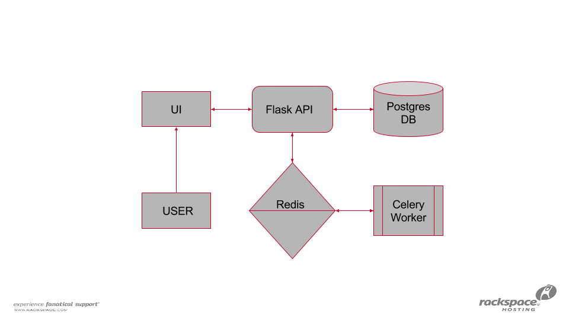

# Health Check As A Service

 API and UI that reflects the current health of a system. It provides current health, historical health and graphical views of system health 
  trends.

## Getting Started
    
### Terms
* `Canary` - Any set of tests, processes, monitoring, etc. that determines the health of a system.

### Architecture
  

For more information on how to use this service, see [API](api.md)

